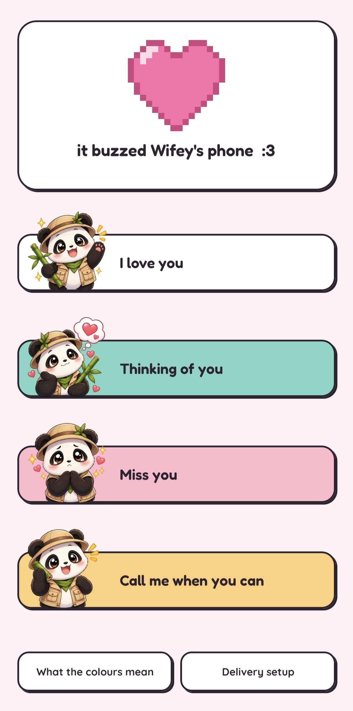
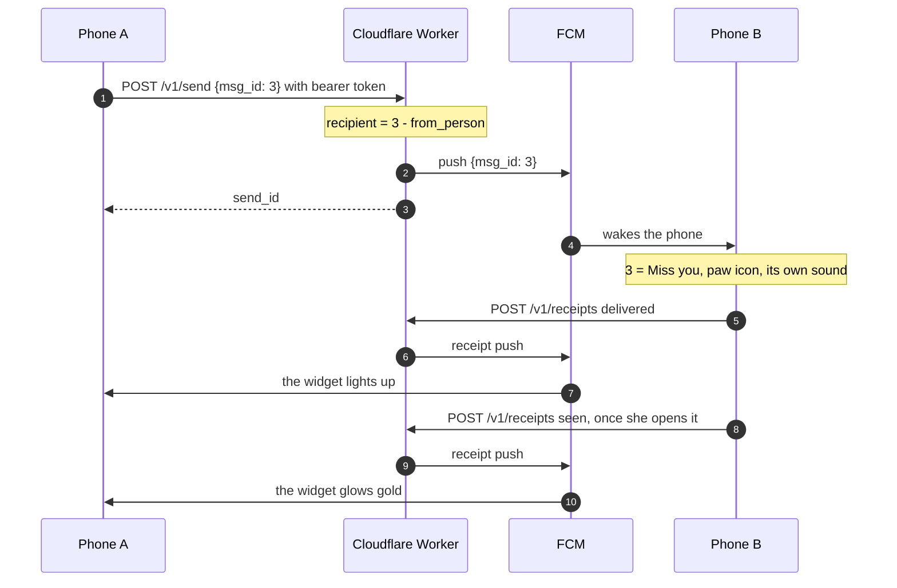

<div align="center">

# Love Button

**Tap a widget on your home screen. Her phone buzzes with a distinct sound.**<br>
An Android app for exactly two people.

[](#building-it)
[](app/)
[](server/)
[](server/)
[](#how-it-works)
[](#how-it-works)
[](#license)

**[📖 Read the Field Manual](docs/Love%20Button%20Field%20Manual.pdf)** ([dark](docs/Love%20Button%20Field%20Manual_dark.pdf))
&nbsp;·&nbsp; [Spec](love-button-spec.md)
&nbsp;·&nbsp; [Setup guide](docs/MANUAL-SETUP.md)
&nbsp;·&nbsp; [Server](server/)

<br>



<sub>The home screen, a few seconds after a send reached her phone.</sub>

</div>

## What it is

Four fixed messages, each with its own widget, its own pixel icon and its own
notification sound. The sender's widget lights up when the message is delivered,
and again when she opens it. There is no message list, no chat, no counter, and
no way to add a third person — the database enforces that last one with a
`CHECK (person IN (1,2))` constraint rather than a convention.

<table align="center">
  <tr>
    <td align="center"><br>I love you</td>
    <td align="center"><br>Thinking of you</td>
    <td align="center"><br>Miss you</td>
    <td align="center"><br>Call me when you can</td>
  </tr>
</table>

**Status: 1.0.** Sideloaded, signed, and in daily use on two phones. The server
runs on free tiers with no card on file.

**[`love-button-spec.md`](love-button-spec.md) is the real document.** It explains
what was built and, more usefully, what was deliberately not built and why. The
**[Field Manual](docs/Love%20Button%20Field%20Manual.pdf)** explains the spec in
ten short chapters: the round trip traced tap to gold tile, what the Worker and
Google each hold, and why each choice was made — every chapter in plain words
first, then the technical detail. This file is just the front door.

## What's interesting here

Small product, real problems. Each of these is written up properly in the spec.

- **The push carries a number, not words.** Her phone receives `msg_id: 3` and
  maps it to text, icon and sound locally, so the words never transit Google's
  servers and a fifth message is an app-only change.
  → [spec §2](love-button-spec.md#why-the-push-carries-a-number-not-words)
- **There is no recipient field anywhere.** The sender is whoever the bearer token
  says; the recipient is computed server-side as `3 - from_person`. Even a stolen
  token can only message its own partner.
  → [spec §4](love-button-spec.md#the-three-invariants)
- **Credentials that are useless if leaked.** Device tokens are stored only as
  SHA-256 hashes, enrolment codes are compared in constant time and rate-limited,
  and the Google key that can push to any device exists only as a Worker secret.
  → [spec §4](love-button-spec.md#4-security-model)
- **Delivery and read receipts over push, races included.** Her phone can
  acknowledge before your own send request has returned, so the send id is minted
  at the tap and the widget it belongs to is recorded *before* the request leaves.
  → [`SendWorker.kt`](app/src/main/java/com/lovebutton/app/work/SendWorker.kt#L67-L71)
- **One irreversible decision, made once.** Android freezes a notification
  channel's sound when it is created, so four distinct sounds meant four channels,
  finalised before the first install.
  → [spec §6.3](love-button-spec.md#63-notification-channels--the-one-irreversible-decision)
- **Reliability on Xiaomi as a feature, not a footnote.** MIUI kills background
  apps in three separate ways; a Delivery setup screen walks through each and
  re-checks on every launch, and an overnight script tests both phones as
  receivers without waking either.
  → [spec §8](love-button-spec.md#8-miui-reliability--a-first-class-feature)
- **Pixel art is authored as ASCII grids.** [`scripts/pixel_icons.py`](scripts/pixel_icons.py)
  turns each grid into vector drawables and Kotlin, and the home screen's heart
  animates each state change pixel by pixel.

## Watching it land

A tap walks the widget up a ladder of states, one widget update per step. The
words underneath are the app's own.

| Idle | Sending | Sent | Delivered | Seen |
|:---:|:---:|:---:|:---:|:---:|
|  |  |  |  |  |
| click the button!<br>`(・ω・)` | on its way to *her*<br>`0o0` | traveling in the interwebs<br>`(• ε •)` | it buzzed *her* phone<br>`:3` | *she* looked at it<br>`(>^o^)>` |

If nothing comes back within 20 seconds the tile goes grey — *didn't get through*
`（◞‸◟）`. A tap still queued behind a slow connection at that point is abandoned
rather than sent late: it is only worth honouring while the person who made it is
still expecting it.

## How it works

Phones cannot reach each other directly — neither has a fixed address and both
spend most of their lives asleep. So a Cloudflare Worker sits between them and
asks Firebase Cloud Messaging to wake the other phone:



The Worker exists because sending through FCM needs a Google service account
private key, and that key can push to any device in the project. It lives in
exactly one place: a Cloudflare Worker secret. Never in this repo, never in the
APK.

<table>
  <tr><td><b>Client</b></td><td>Kotlin · Jetpack Compose (screens) · Glance (widgets) · WorkManager · DataStore · Firebase Messaging</td></tr>
  <tr><td><b>Server</b></td><td>TypeScript · Hono · Cloudflare Workers · D1 (SQLite) · KV — <a href="server/"><code>server/</code></a></td></tr>
  <tr><td><b>Identity</b></td><td>Opaque per-device bearer tokens. No Firebase Auth, no Google Sign-In (<a href="love-button-spec.md#why-not-firebase-auth">why</a>)</td></tr>
  <tr><td><b>Tests</b></td><td>79 server tests on the Workers runtime (Vitest) · 138 JVM unit tests on the app</td></tr>
  <tr><td><b>Cost</b></td><td>Zero. Free tiers only, no card.</td></tr>
</table>

## Documentation

| Document | What it covers |
|---|---|
| **[Field Manual](docs/Love%20Button%20Field%20Manual.pdf)** ([dark](docs/Love%20Button%20Field%20Manual_dark.pdf)) | How the Love Button works — 23 A5 pages with a glossary, reads well on a phone. Start here. Source: [`docs/manual/field-manual.html`](docs/manual/field-manual.html). |
| **[`docs/HOW-IT-WAS-BUILT.md`](docs/HOW-IT-WAS-BUILT.md)** | The other half: how the work was done, in what order, and what went wrong on real phones first. |
| **[`love-button-spec.md`](love-button-spec.md)** | The binding spec: what was built, what was deliberately not, and why. |
| **[`docs/MANUAL-SETUP.md`](docs/MANUAL-SETUP.md)** | Everything that needs a browser login or a phone in your hand. |
| **[`docs/SECRETS.md`](docs/SECRETS.md)** | What the secrets are, where each one lives, and how to restore them. |
| **[`server/README.md`](server/README.md)** | The Worker on its own: routes, schema, commands. |
| **[`docs/superpowers/`](docs/superpowers/)** | The design doc and implementation plan behind each milestone. |

## Repository layout

- **[`app/`](app/)** — the Android client: Compose screens, Glance widgets, WorkManager jobs
- **[`server/`](server/)** — the Cloudflare Worker: Hono routes, D1 migrations, tests
- **[`docs/`](docs/)** — the field manual and its source, setup guide, secrets runbook, and each milestone's design and plan
- **[`scripts/`](scripts/)** — the pixel-icon generator, the manual's PDF build, secrets backup and restore, the overnight check

## Known limits, honestly

- **Force-stopping the app kills FCM delivery** until it is opened again. This
  cannot be fixed in code — it is how Android works. If messages stop arriving,
  that is the first thing to check.
- **Both phones are Xiaomi**, where autostart is off by default for sideloaded
  apps and battery saver defaults to "Restricted". The app's Delivery setup
  screen walks through each setting and re-checks what it can on every launch.
- **China ROMs have no Google Play Services**, so FCM does not exist there. Both
  phones must be on a Global or EEA build.
- A message tapped with no signal is **abandoned after 20 seconds**, not queued.
  The bubble goes grey and you send again if you still mean it.

## Building it

You need a Firebase project, a Cloudflare account, and two physical Android
phones. [`docs/MANUAL-SETUP.md`](docs/MANUAL-SETUP.md) walks through everything
that needs a browser login or a phone in your hand.

```bash
git config core.hooksPath .githooks   # refuses to commit keys; do this first
./gradlew :app:assembleDebug
./gradlew :app:testDebugUnitTest
cd server && npm install && npx vitest run
```

Two files are needed and are not in this repo:

- `app/google-services.json` — from the Firebase console.
  [`app/google-services.json.example`](app/google-services.json.example) shows its
  shape. The real one ships inside the APK anyway, so it is not strictly secret;
  keeping it out stops anyone cloning a working client against the project by
  accident.
- `local.properties` — needs `apiBaseUrl=https://love-button.<subdomain>.workers.dev`.
  The build fails without it on purpose, rather than producing an APK that
  installs cleanly and then fails at enrolment.

## Publishing safely

This repo is public, which is only safe because of
[§4 of the spec](love-button-spec.md#4-security-model). The short version: the
service account key is a Worker secret; enrolment codes are Worker secrets; only
SHA-256 hashes of device tokens are stored, so a database leak yields no working
credentials; and `/v1/send` takes a message id and nothing else, so there is no
field in which to name a victim.

The pre-commit hook in `.githooks/` refuses any commit containing a private key
block or a service account JSON, and refuses the keystore, `keystore.properties`,
`local.properties`, `.dev.vars`, `google-services.json` and encrypted secret
bundles by name. Enable it once per clone with the `git config` line above — git
does not do it for you.

**The release keystore stays out of this repo.** Losing it means the app can never
be updated in place on her phone again; it would have to be uninstalled and
re-enrolled. It is backed up, encrypted, off-repo — see
[`docs/SECRETS.md`](docs/SECRETS.md).

## License

The code is released under the [MIT License](LICENSE). The bundled fonts,
Fredoka and Quicksand, keep their own
[SIL Open Font License 1.1](https://openfontlicense.org).
